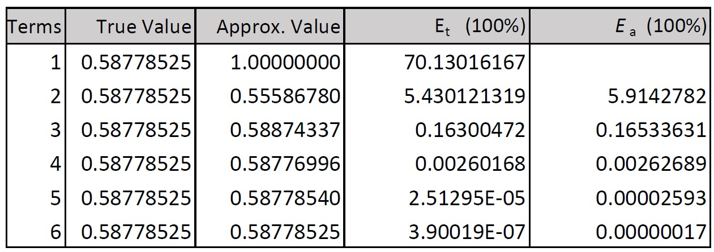
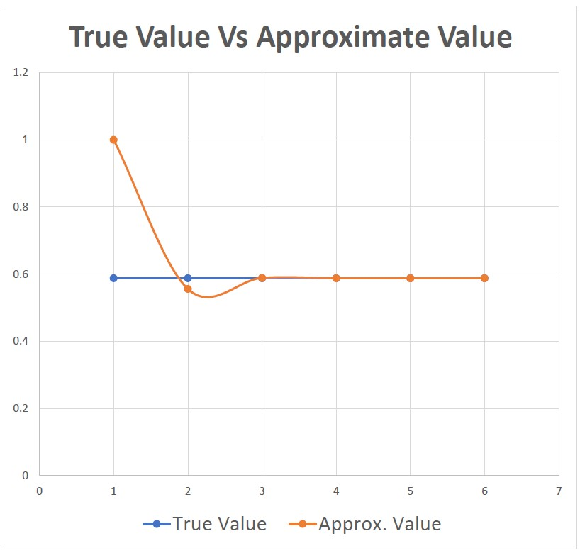
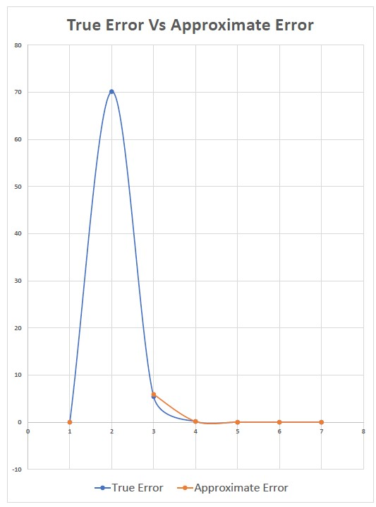

# Truncation Error
 Truncation Error

<b>Problem Statement 1</b>-Determine the number of terms necessary to approximate cos
x to 8 significant figures using the Maclaurin series
approximation.

Calculate the approximation using a value of x = 0.3π.

<b>Analysis</b>- 

<b>Problem Statement 2</b> - .The infinite series

converges on a value of f (n) = π
4
/90 as n approaches infinity.
Write a program in single precision to calculate f (n) for n =
10,000 by computing the sum from i = 1 to 10,000. Then repeat
the calculation but in reverse order—that is, from i = 10,000 to
1 using increments of −1. In each case, compute the true percent
relative error. Explain the results.

<b>Analysis</b>- 

Round-Off Error

The floating-point numbers induce an error and hence can not be represented exactly. While carrying out operations on the values, the errors propagate.

Case 1: Forward Propagation

When computing in the forward direction, according to the function provided, bigger values are added initially. In such a scenario, towards the end, when smaller terms are added to the bigger term, they have a fairly less effect on the bigger number. That is, significance of the smaller numbers is lost when adding with a comparatively large number.

Case 2: Backward Propagation

When computing in the backward direction, according to the function provided, smaller terms are added first. The significance is retained when adding two smaller numbers, which makes them into comparatively larger numbers eventually. Now, when the computed large number is added to the larger terms of the summation, the significance is not lost of either, therefore providing better results, and lesser percentage relative error.